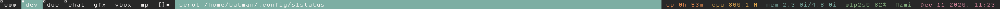

slstatus
---
[slstatus](https://tools.suckless.org/slstatus/) is a status monitor for window managers that use WM_NAME or stdin to fill the status bar.

Usage
--------
slstatus might be the easiest tool developed by the suckless community. All the the features are commented inside the `config.h` header file. slstatus also allows custom scripts. 

```bash
git clone https://github.com/manu-febie/slstatus.git
```

```bash
sudo make clean install
```
Dependencies
---

I use colored text output for slstatus and in order for this to work you need to have dwm patched with [status2d](https://dwm.suckless.org/patches/status2d/dwm-status2d-20200508-60bb3df.diff)

I don't use any display manager so I add `slstatus` inside my `.xinitrc` file. Always make sure you `exec dwm` at the end of the file.

```bash
# xinitrc
exec slstatus &
```

Example configurations
--------
```c 
/* config.h */
static const struct arg args[] = {
	/* function format          argument */
	{ wifi_perc, "^c#89b482^ wifi %s%% ",    "wlp2s0"       },
	{ datetime,  "^c#d3869b^ %s ",           "%b %d %Y, %R" },
};
```


Features
--------
- Battery percentage/state/time left
- CPU usage
- CPU frequency
- Custom shell commands
- Date and time
- Disk status (free storage, percentage, total storage and used storage)
- Available entropy
- Username/GID/UID
- Hostname
- IP address (IPv4 and IPv6)
- Kernel version
- Keyboard indicators
- Keymap
- Load average
- Network speeds (RX and TX)
- Number of files in a directory (hint: Maildir)
- Memory status (free memory, percentage, total memory and used memory)
- Swap status (free swap, percentage, total swap and used swap)
- Temperature
- Uptime
- Volume percentage
- WiFi signal percentage and ESSID


